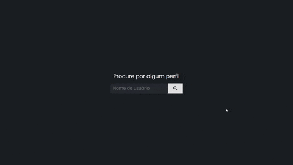

<h1 align="center">
  
  Github Overview 
  
</h1>

<h4 align="center">
  A Web Application where users can search for other users and take a look at their profile and repositories sorted by stars amount
</h4>

  
  

  <a href="#technologies">Used technologies</a>&nbsp;&nbsp;&nbsp;|&nbsp;&nbsp;&nbsp;
  <a href="#objective">Project's goal</a>&nbsp;&nbsp;&nbsp;|&nbsp;&nbsp;&nbsp;
  <a href="#final-result">Final result</a>
  <a href="#how-to-use">How to Run</a>

&nbsp;&nbsp;&nbsp;&nbsp;&nbsp;&nbsp;&nbsp;&nbsp;&nbsp;
&nbsp;&nbsp;&nbsp;&nbsp;&nbsp;&nbsp;&nbsp;&nbsp;&nbsp;
&nbsp;&nbsp;&nbsp;&nbsp;&nbsp;&nbsp;&nbsp;&nbsp;&nbsp;
&nbsp;&nbsp;&nbsp;&nbsp;&nbsp;&nbsp;&nbsp;&nbsp;&nbsp;
&nbsp;&nbsp;&nbsp;&nbsp;

    

<h2 id="techonologies" name="technologies">
  :rocket: Used Technologies
</h2>

- [Vue.js](https://br.vuejs.org) to build all the app in general
- [Vuex](https://vuex.vuejs.org/) to manage the state of the app
- [Sass](https://sass-lang.com/) to style all the components
- Github API to retrieve all the data that the user can see

<h2 id="objective" name="objective">
  :dart: Project's goal
</h2>

The goal of this project was practing Vue.js and styling with Sass, and also a little challenge of creating a good UI, I really enjoyed the final result.

<h2 id="final-result" name="final-result">
  :clipboard: Final result
</h2>

### [You can check the final result clicking here](https://github-profile-overview.netlify.app/)

---

Hope you liked this project :smiley: 
:wave: [Get in touch!](https://www.linkedin.com/in/tiagodiass)

### Author: Tiago Dias

